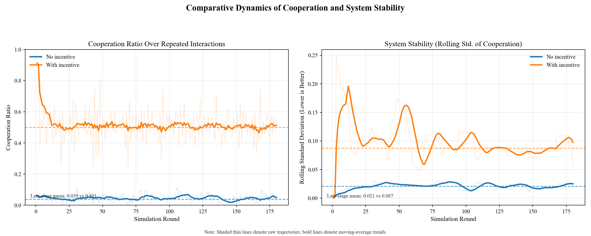

# 校园 Wi-Fi 共享平台

基于博弈论激励机制的校园带宽共享系统

## 项目概述

本系统是一个校园 Wi-Fi 带宽共享平台。通过信誉系统、代币激励、联盟博弈与信任担保等多层博弈机制，将“只用不共享”的囚徒困境转化为“多共享更有利”的合作均衡，鼓励学生主动共享闲置带宽。

## 技术栈

- 后端：Python + FastAPI + SQLAlchemy
- 数据库：SQLite（自动创建，无需额外配置）
- 前端：HTML / CSS / JavaScript + Chart.js
- 实时推送：Server-Sent Events（SSE）

## 快速开始

```bash
pip install -r requirements.txt
python main.py
```

浏览器访问：`http://localhost:8000`

## 核心功能

### 用户系统
- 支持注册 / 登录，账号长期绑定，支撑无限期重复博弈。
- 新用户注册后 7 天保护期：免拒绝、免冻结，但价格惩罚仍生效。

### 带宽管理
- 分享带宽：贡献闲置带宽并获得即时信誉奖励；当他人消费你的带宽时，校园币实时到账。
- 请求带宽：消费前提供费用预估（成本、信誉变化、拒绝风险）；不能消费自己共享的带宽。
- 带宽池看板：展示总带宽、个人最大可请求量、个人贡献量与当前动态价格。

### 信誉系统（Credit）
| 等级 | 信誉值 | 徽章 | 折扣 |
|------|--------|------|------|
| Eagle | >= 90 | 🦅 | 消费 -30% |
| Tiger | >= 70 | 🐯 | 消费 -15% |
| Dolphin | >= 50 | 🐬 | 标准价 |
| Turtle | < 50 | 🐢 | 暂停/受限 |

- 分享带宽 -> 信誉提升（高峰时段奖励翻倍）。
- 消费带宽 -> 信誉小幅下降（-0.05 / MB）。

### 校园币（代币激励）
- 真实流转：消费方支付的校园币直接转给分享方。
- SSE 实时推送：他人消费你的带宽后，余额实时更新并有动画提示。
- 担保佣金：担保他人后，可获得其每笔消费金额的 1% 佣金。

### 分享率与惩罚（30 天滑动窗口）
| 分享率 | 结果 |
|--------|------|
| >= 20% | 正常 |
| 10% ~ 20% | 消费价格 +50% |
| < 10% | 价格 +100% + 线性拒绝概率（0% => 100%拒绝） |
| 低分享导致拒绝累计 5 次 | 账户冻结 3 天 |

### 分享增益（折现因子 delta）
- 公式：`delta = min(0.99, 0.5 + 0.005 * min(reputation_score, 100) + 0.1 * min(recent_sharing_rate, 1.0))`
- 影响分享信誉奖励倍数（1.0x ~ 2.0x），越活跃分享增益越高。

### 联盟 / 互助小组
- 支持创建 / 加入互助联盟；消费时优先匹配联盟成员，并获得额外 8% 折扣。
- 联盟内折扣节省累计为“联盟奖池”，按成员贡献带宽通过 Shapley 值分配。

### 信任担保
- 信誉 >= 70（Tiger 及以上）可担保新用户。
- 被担保用户获得更高信任额度，并额外获得 50 校园币。
- 担保人获得被担保用户每次消费的 1% 佣金。

### 动态定价
- 带宽池低于基准的 80%：基础价格 +10%
- 带宽池高于基准的 120%：基础价格 -10%

### 排行榜
- 按信誉排序，前 10% 用户标记 🏅 并额外享受 5% 消费折扣。
- 徽章：共享之星（分享 > 500MB）、互助达人（Eagle 级）。

### 反互刷检测
- 若 1 小时内双向交易超过 10MB，分享方本次“额外信誉增益”会被取消（校园币仍正常转账），用于抑制刷分。

## API 接口

| 方法 | 路径 | 说明 |
|------|------|------|
| POST | /api/register | 注册 |
| POST | /api/login | 登录 |
| GET | /api/user-stats/{id} | 用户状态 |
| POST | /api/share-bandwidth | 分享带宽 |
| POST | /api/request-bandwidth | 请求带宽 |
| GET | /api/cost-preview | 消费预览 |
| GET | /api/available-bandwidth | 带宽池状态 |
| POST | /api/coalition/create | 创建联盟 |
| POST | /api/coalition/join | 加入联盟 |
| GET | /api/coalition/{id} | 联盟详情 |
| GET | /api/coalitions | 联盟列表 |
| POST | /api/trust/guarantee | 担保用户 |
| GET | /api/leaderboard | 排行榜 |
| GET | /api/currency-stream/{id} | SSE 实时校园币流 |

## 项目结构

```text
├── main.py              # 后端入口（FastAPI + 博弈引擎）
├── requirements.txt     # Python 依赖
├── campus_wifi.db       # SQLite 数据库（自动创建）
├── templates/
│   └── index.html       # 前端主页面
├── static/
│   ├── style.css        # 样式
│   └── script.js        # 前端逻辑
├── README.md            # 英文文档
└── README-CN.md         # 中文文档
```

## 启动说明与常见问题

### 说明

1. 首次运行会自动创建 `campus_wifi.db`，重启后数据保留。
2. 默认端口 `8000`，若冲突可修改 `main.py` 末尾 `port` 参数。
3. 删除 `campus_wifi.db` 可重置全部数据。

### FAQ

Q：注册提示“邮箱已被注册”  
A：使用其他邮箱，或直接登录已有账号。

Q：请求带宽提示“暂无可用带宽”  
A：当前带宽池为空，需要其他用户先分享带宽。

Q：校园币不足  
A：先分享带宽，等待他人消费后会自动获得校园币。

Q：账号被冻结  
A：若分享率长期低于 10% 且累计 5 次低分享拒绝，账号会冻结 3 天，到期自动解冻。

## 博弈论激励机制（详细）

### 核心问题

校园 Wi-Fi 共享本质上是一个**公共资源博弈**：

- 每个人都想使用别人共享的带宽（搭便车）。
- 但如果所有人都只用不共享，带宽池会枯竭，系统最终失效。
- 这就是典型的**囚徒困境**：个体理性导致集体非理性。

本系统通过多机制叠加把一次性互动转化为无限期重复博弈，使“持续共享”成为理性个体的最优策略，最终形成合作均衡。

---

### 机制 1：重复博弈 + 折现因子（delta）

**原理**：单次博弈中背叛常为优势策略；当博弈无限重复，且未来收益权重足够高时，合作可成为均衡。  

**实现**：

- 账号长期绑定，每次交互都是重复博弈的一轮。
- 折现因子：`delta = min(0.99, 0.5 + 0.005 * min(credit_value, 100) + 0.1 * min(recent_sharing_rate, 1.0))`
- `delta` 越高，分享信誉奖励倍数越高（1.0x ~ 2.0x）。
- 活跃用户 `delta` 更高，更重视长期收益，更倾向持续合作。

**效果**：用户会主动维持分享行为，以保持高 `delta` 与高增益。

---

### 机制 2：信誉系统（Credit）

**原理**：信誉机制缓解信息不对称，形成分离均衡。高质量用户主动维护信誉，低质量用户被系统边缘化。  

**实现**：

- 分享带宽 -> 信誉提升
- 消费带宽 -> 信誉下降（-0.05 / MB）
- 信誉等级决定消费折扣

| 等级 | 信誉值 | 折扣 |
|------|--------|------|
| 🦅 Eagle | >= 90 | -30% |
| 🐯 Tiger | >= 70 | -15% |
| 🐬 Dolphin | >= 50 | 标准价 |
| 🐢 Turtle | < 50 | 暂停/受限 |

**效果**：形成“分享 -> 信誉上升 -> 折扣增加 -> 消费更划算 -> 更愿意分享”的正循环。

---

### 机制 3：代币激励（校园币）

**原理**：代币真实流转让分享收益可量化，实现激励相容。  

**实现**：

- 分享行为本身不直接发币，避免“无贡献套利”。
- 他人消费你的带宽时，校园币实时转入你账户。
- SSE 实时反馈增强即时激励。
- 担保机制带来 1% 佣金，促使担保人审慎选择对象，形成信誉传递链。

**效果**：分享的经济收益清晰可见，长期合作更具吸引力。

---

### 机制 4：分享率惩罚（触发策略）

**原理**：一旦检测到背叛（长期搭便车），系统立即惩罚，使长期代价超过短期收益。  

**实现**：

| 分享率 | 惩罚 |
|--------|------|
| >= 20% | 正常 |
| 10% ~ 20% | 消费价格 +50% |
| < 10% | 价格 +100% + 线性拒绝概率 |
| 低分享导致拒绝累计 5 次 | 冻结 3 天 |

- 拒绝概率：`P(rejection) = (10% - sharing_ratio) * 10`
- 新用户保护期：免拒绝/冻结，但价格惩罚仍生效
- 30 天滑动窗口：可通过后续分享逐步修复状态，避免“永久惩罚陷阱”

**效果**：搭便车边际成本显著上升，长期不再划算。

---

### 机制 5：联盟博弈（互助小组）

**原理**：小群体合作降低协调成本，Shapley 分配保证公平，减少联盟内搭便车。  

**实现**：

- 联盟内优先匹配 + 额外 8% 折扣
- 联盟收益 = 内部互消费节省总额（奖池）
- Shapley 分配：`phi_i = total_saved * (member_i_contribution / total_coalition_contribution)`

**效果**：把“陌生人博弈”转化为“熟人博弈”，社会约束与经济激励共同推动合作。

---

### 机制 6：动态定价（供需信号）

**原理**：用价格信号引导资源配置。紧缺时提高价格促进供给，充裕时降低价格促进消费。  

**实现**：

- 带宽池 < 80% 基准（500MB）：基础价 +10%
- 带宽池 > 120% 基准：基础价 -10%
- 与信誉折扣叠加，高信誉用户长期更有优势

---

### 机制 7：互刷检测（反串谋）

**原理**：若双方频繁互相消费，会导致“刷信誉”风险。检测后取消额外信誉奖励，降低互刷收益预期。  

**实现**：

- 检测 1 小时内双向交易是否均超过 10MB
- 命中后：仅取消额外信誉增益，校园币转账仍执行

**效果**：抑制刷分，维护激励机制可信度。

---

### 机制 8：排行榜激励（锦标赛机制）

**原理**：将单次博弈扩展为多期竞争，用户为未来排名收益持续合作。  

**实现**：

- 按信誉公开排名
- 前 10% 用户额外 5% 折扣
- 徽章激励：共享之星、互助达人

---

### 整体激励逻辑

```text
分享带宽
  -> 信誉提升（delta 加成）
  -> 等级提升 -> 消费折扣增大
  -> 他人消费 -> 校园币实时到账
  -> 分享率提升 -> 消费价格下降、拒绝风险下降
  -> 排行榜收益 -> 额外折扣
  -> 联盟奖池 -> 团队协作收益增加

不分享
  -> 分享率下降 -> 消费价格上升（最多 +100%）
  -> 拒绝概率上升（最多 100%）
  -> 信誉下降 -> 折扣减少
  -> 低分享拒绝累计 5 次 -> 冻结 3 天
```

**关键结论**：多机制叠加后，“持续共享”在短期（校园币收益）、中期（信誉折扣）和长期（排名奖励）均优于“只用不共享”，实现个体最优与系统最优的一致。

---

## 仿真过程与结果

为更直观验证机制有效性，项目提供了贴近业务规则的仿真脚本：

- 脚本：`simulate_game_theory_incentives.py`
- 输出图：`project_like_simulation.png`
- 对照设置：
  - 场景 A：无激励（基线搭便车倾向）
  - 场景 B：有激励（信誉 + 校园币转移 + 惩罚 + 拒绝 + 冻结）

### 仿真流程

每轮模拟包含以下步骤：

1. 更新用户状态（30 天窗口衰减、冻结倒计时、在线/离线随机性）。
2. 用户基于期望收益在 `share` 与 `free-ride` 间做策略选择。
3. 执行分享：带宽入池并产生信誉收益。
4. 执行消费：应用价格/折扣/惩罚/拒绝规则，并完成校园币转账。
5. 记录系统指标并进入下一轮。

该模型在保持规则一致性的前提下做了适度抽象，用于更清晰地展示对照效果。

### 图中展示内容

当前输出图包含两个子图：

1. **合作率随轮次变化**
   - 细线：原始轨迹（raw）
   - 粗线：移动平均趋势（smooth）
   - 虚线：后期均值（late-stage mean）
2. **系统稳定度**
   - 定义为合作率滚动标准差（越低越稳定）
   - 同样展示原始轨迹、平滑趋势和后期均值

### 复现实验

```bash
python simulate_game_theory_incentives.py
```

运行后查看 `project_like_simulation.png`：



### 当前参数下的示例结果

- 后期合作率：
  - 无激励：约 `0.039`
  - 有激励：约 `0.501`
- 解释：
  - 激励机制显著提高了长期合作水平。
  - 系统由低合作均衡向高合作均衡迁移，并维持可接受的稳定性。
